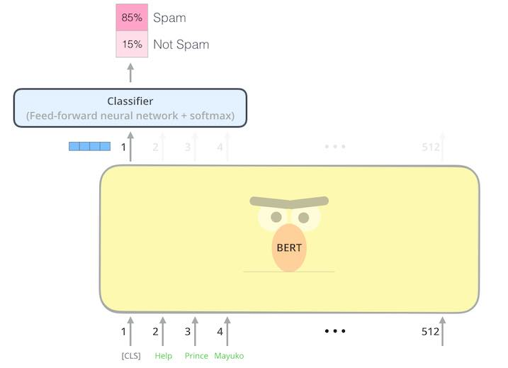

**Lectures on Computational Linguistics 2021**

# Tranining a sentence classifier using BERT-based models (in Pytorch and compatible with HuggingFace)

**Author**: Danilo Croce

This is a Pytorch (+ **Huggingface** transformers) implementation of a "simple" text classifier defined using BERT-based models. 
In this lab we will see how it is simple to use BERT for a sentence classification task, obtaining state-of-the-art results in few lines of python code.

In a nutshell, we will "implement" this architecture:

Given an input sentence, we will use a BERT-based architecture to encode it and a linear classifier is used to associate the produced vector to one of the `c` classes considered in the classification task.

Most importantly, we will show how to use the same code but using different transformer based architectures, such as:
- RoBERTa or Electra in English;
- multilingual BERT or XLMRoBERTA;
- specific encoders trained on Italian corpora.

Moreover, we will evaluate our code in two sentence classification tasks:
- Question Classification in English
- Subjectivity identification in Italian 

by (hopefully) changing only one or two lines of code. 
